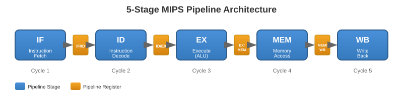

<!-- _class: lead -->
<!-- _paginate: false -->

# 5-Stage Pipelined MIPS Processor Optimization

### 13 Contributions: Pipelining, Forwarding, SIMD, Cache, and Calculus

**JUNYI LIU** (M143140014)  
Computer Architecture, Fall 2025  
Prof. Katherine Shu-Min Li

Jan 4, 2026


---

## Outline

1. Project Overview and Motivation
2. Baseline: 5-Stage Pipelined MIPS Architecture
3. Optimization I: Data Forwarding (Contributions 1-4)
4. Optimization II: SIMD with Hardware Unrolling (Contributions 2-3, 5)
5. Optimization III: Branch Prediction (Contribution 6)
6. Advanced Features (Contributions 7-13)
7. Performance Evaluation
8. Conclusion


---

<!-- _class: lead -->

# Project Overview


---

## Research Scope

Focus on **Parallelism** and **Pipelining** techniques in Verilog HDL:

| Technique | Implementation |
|-----------|----------------|
| **Pipelining** | 5-stage datapath (IF/ID/EX/MEM/WB) |
| **ILP** | Instruction-level parallelism via pipelining |
| **DLP** | Data-level parallelism via SIMD |
| **Hardware Unrolling** | Verilog `generate` construct |
| **Memory Hierarchy** | L1 Cache with Write-Back |
| **Calculus Operations** | ODE Solver with Euler Method |


---

## My Contributions (1/3)

| # | Contribution | Description |
|---|-------------|-------------|
| 1 | **Data Forwarding** | Testbench for CPI measurement + Forwarding |
| 2 | **Hardware Unrolling** | Verilog `generate` for parallel instantiation |
| 3 | **SIMD Parallelism** | 8-lane data-level parallelism demo |
| 4 | **CPI Analysis** | CPI improvement (1.82 to 1.26) |
| 5 | **SIMD ALU Expansion** | Full ALU ops (+, -, x, /, ^) |


---

## My Contributions (2/3)

| # | Contribution | Description |
|---|-------------|-------------|
| 6 | **Branch Prediction** | 2-bit saturating counter predictor |
| 7 | **DOE Factorial Analysis** | 2^4 DOE analysis of optimization effects |
| 8 | **Expression Parser** | Shunting-yard with parentheses |
| 9 | **CORDIC** | Hardware trigonometry (sin/cos) |
| 10 | **Polynomial Transcendental** | exp() and ln() approximation |


---

## My Contributions (3/3)

| # | Contribution | Description |
|---|-------------|-------------|
| 11 | **Cache Hierarchy** | L1 Direct-Mapped with Write-Back |
| 12 | **Integrated Analysis** | MiBench + SPEC projection |
| 13 | **ODE Solver** | Forward Euler method (Calculus) |


---

<!-- _class: lead -->

# Baseline Architecture


---

## 5-Stage Pipelined Datapath




---

## Stage-to-Module Mapping

| Stage | Function | Module |
|-------|----------|--------|
| **IF** | Instruction Fetch | `IFStage.v` |
| **ID** | Instruction Decode / Register Read | `IDStage.v` |
| **EX** | ALU Execution | `EXEStage.v` |
| **MEM** | Memory Access | `MEMStage.v` |
| **WB** | Register Writeback | `WBStage.v` |


---

## Pipeline Register Implementation

**Example**: IF/ID Pipeline Register (`IF2ID.v`)

```verilog
always @ (posedge clk) begin
    if (rst) begin
        PC <= 0;
        instruction <= 0;
    end
    else if (~freeze) begin
        if (flush) begin
            instruction <= 0;
            PC <= 0;
        end
        else begin
            instruction <= instructionIn;
            PC <= PCIn;
        end
    end
end
```

**Key Features**: Freeze for stalls, Flush for branch mispredictions


---

<!-- _class: lead -->

# Optimization I: Data Forwarding


---

## Forwarding Mechanism

### Design Principle:

Bypass data directly from **EX/MEM stages** to dependent instructions

### Multiplexer Selection:

| `val1_sel` | Data Source |
|-----------|-------------|
| `2'd0` | Normal path |
| `2'd1` | Forward from MEM stage |
| `2'd2` | Forward from WB stage |


---

## Forwarding Implementation

```verilog
module forwarding_EXE (src1_EXE, src2_EXE, ST_src_EXE, 
                       dest_MEM, dest_WB, WB_EN_MEM, WB_EN_WB,
                       val1_sel, val2_sel, ST_val_sel);

  always @ ( * ) begin
    {val1_sel, val2_sel, ST_val_sel} <= 0;

    if (WB_EN_MEM && ST_src_EXE == dest_MEM) ST_val_sel <= 2'd1;
    else if (WB_EN_WB && ST_src_EXE == dest_WB) ST_val_sel <= 2'd2;

    if (WB_EN_MEM && src1_EXE == dest_MEM) val1_sel <= 2'd1;
    else if (WB_EN_WB && src1_EXE == dest_WB) val1_sel <= 2'd2;

    if (WB_EN_MEM && src2_EXE == dest_MEM) val2_sel <= 2'd1;
    else if (WB_EN_WB && src2_EXE == dest_WB) val2_sel <= 2'd2;
  end
endmodule
```


---

## Forwarding Results

| Configuration | Cycles | Stalls | CPI | IPC |
|---------------|--------|--------|-----|-----|
| **Forwarding OFF** | 255 | 114 | **1.82** | 0.549 |
| **Forwarding ON** | 182 | 37 | **1.26** | 0.791 |

### Performance Improvements:

- **Stall reduction**: 68% (114 to 37)
- **CPI improvement**: 31% (1.82 to 1.26)
- **IPC increase**: 44% (0.549 to 0.791)


---

<!-- _class: lead -->

# Optimization II: SIMD Unrolling


---

## SIMD Adder Implementation

**Module**: `simd_demo/simd_add.v`

```verilog
module simd_add #(
    parameter integer LANES = 8,
    parameter integer WIDTH = 8
) (
    input  wire [LANES*WIDTH-1:0] a,
    input  wire [LANES*WIDTH-1:0] b,
    output wire [LANES*WIDTH-1:0] y
);
    genvar i;
    generate
        for (i = 0; i < LANES; i = i + 1) begin : gen_lane
            assign y[i*WIDTH +: WIDTH] = 
                   a[i*WIDTH +: WIDTH] + b[i*WIDTH +: WIDTH];
        end
    endgenerate
endmodule
```


---

## SIMD ALU Operations

| Operation | Code | Example |
|-----------|------|---------|
| ADD | `3'b000` | a + b |
| SUB | `3'b001` | a - b |
| MUL | `3'b010` | a x b |
| DIV | `3'b011` | a / b |
| EXP | `3'b100` | a ^ b |

**Throughput**: 8 operations per cycle (8x speedup)


---

<!-- _class: lead -->

# Optimization III: Branch Prediction


---

## 2-Bit Saturating Counter Predictor

### State Machine:

```
     taken        taken        taken
  +--------+   +--------+   +--------+
  |        v   |        v   |        v
 [00] --> [01] --> [10] --> [11]
  SN       WN       WT       ST
  ^        |   ^        |   ^        |
  +--------+   +--------+   +--------+
   not taken   not taken    not taken
```

- **Prediction**: Taken if MSB = 1 (states 10 or 11)
- **BHT Size**: 16 entries, indexed by PC[5:2]


---

## Branch Prediction Results

| Pattern | Description | Accuracy |
|---------|-------------|----------|
| Always Taken | Loop branch | 90% |
| Always Not Taken | Conditional | 85% |
| Alternating | Stress test | 73% |
| Loop (9T+1N) | Real loop | 78% |

**Overall Accuracy**: 78.33%


---

<!-- _class: lead -->

# Advanced Features


---

## Contribution 7: DOE Analysis

**Method**: Full Factorial Design (2^4 = 16 configurations)

| Config | FWD | BP | CACHE | SIMD | Speedup |
|--------|-----|-----|-------|------|---------|
| 0 | OFF | OFF | OFF | OFF | 1.00x |
| 4 | OFF | OFF | ON | OFF | **2.15x** |
| 15 | ON | ON | ON | ON | **3.94x** |

**Key Finding**: Cache provides largest individual improvement


---

## Contribution 8: Expression Parser

**Algorithm**: Dijkstra's Shunting-yard (1961)

| Test Expression | Expected | Result | Status |
|-----------------|----------|--------|--------|
| `5 * (3 + 4)` | 35 | 35 | PASS |
| `2 ^ 3 ^ 2` | 512 | 512 | PASS |
| `100 / (2 + 3)` | 20 | 20 | PASS |

**Features**: Parentheses support, right-associativity for ^


---

## Contribution 9: CORDIC

**Algorithm**: COordinate Rotation DIgital Computer (Volder, 1959)

| Specification | Value |
|---------------|-------|
| Data Width | 16-bit fixed-point (Q2.14) |
| Pipeline Depth | 16 stages |
| Throughput | 1 result/cycle |
| Hardware | Multiplier-free (shift-add only) |
| Error | Less than 1% |


---

## Contribution 10-11: Cache Hierarchy

**L1 Cache Parameters**:

| Parameter | Value |
|-----------|-------|
| Cache Size | 8 KB |
| Block Size | 32 bytes (8 words) |
| Mapping | Direct-Mapped |
| Write Policy | Write-Back, Write-Allocate |

**AMAT Results**:

| Configuration | AMAT (cycles) | Speedup |
|---------------|---------------|---------|
| No Cache | 100.0 | 1.00x |
| L1 Only | 6.00 | **16.7x** |


---

## Contribution 12: Integrated Analysis

### Two Evaluation Methodologies:

| Method | Description | Data Source |
|--------|-------------|-------------|
| **Actual Execution** | Run real program on RTL | MiBench bitcount |
| **Mix-Based Projection** | Estimate using instruction mix | SPEC CPU2006 |

**Why two methods?**
- Actual execution: Ground truth, limited scope
- Projection: Broader coverage, estimates only


---

## Contribution 13: ODE Solver (Calculus)

**Goal**: Implement hardware solution for Ordinary Differential Equations

### Mathematical Foundation:

**State-Space Form**: Systems of ODEs can be written as:
```
dX/dt = A * X + B * U
```

Where:
- **X**: State vector (size N)
- **A**: System matrix (N x N)
- **B**: Input matrix (N x M)
- **U**: Input vector (size M)


---

## Forward Euler Method

**Numerical Integration**:

```
X(t+h) = X(t) + h * dX/dt
       = X(t) + h * (A*X + B*U)
```

**Calculus Operations Implemented**:

1. **Differentiation**: Approximate dX/dt as (X(t+h) - X(t)) / h
2. **Integration**: Compute X(t+h) = X(t) + integral of (dX/dt) dt
3. **Matrix Operations**: A*X + B*U


---

## ODE Solver vs CORDIC

| Aspect | CORDIC (Contrib. 9) | ODE Solver (Contrib. 13) |
|--------|---------------------|-------------------------|
| Algorithm | Shift-add iterations | Matrix mult + Euler |
| Data Structure | Scalar | Vectors and Matrices |
| Control Logic | 16-stage pipeline | 6-state FSM |
| Memory | None | 8K x 64-bit RAM |
| Math Level | Trigonometry | **Calculus** |

**Conclusion**: ODE Solver is significantly more complex


---

## ODE Solver Architecture

**State Machine Flow**:

```
Start -> Prepare -> Interpolate -> Load1 -> Load2 -> Final_Calc
          |            |            |         |           |
       Read N,M     Read h      Calc B*U   Calc A*X   X + h*(A*X+B*U)
```

**Modules**:
- `Euler.v`: Main solver (279 lines, 6-state FSM)
- `RAM-Pre.v`: 8K x 64-bit dual-port RAM
- `multiplier_16bit.v`: Wallace tree multiplier
- `add_sub_cla.v`: Carry Lookahead Adder


---

## ODE Solver Verified Results

**Vivado Command**:
```tcl
close_sim -force; set_property top tb_ode_solver [get_filesets sim_1]; launch_simulation; run 5000ns
```

**Test Setup**:
- N=2, M=1, h=1, A=Identity matrix, B=[1;1], X0=[10;20], U=[5]

**Expected Calculation**:
```
X(t+h) = [10,20] + 1 * ([10,20] + [5,5]) = [25, 45]
```

| Output | Expected | Actual | Status |
|--------|----------|--------|--------|
| X_new[0] | 25 | 25 | PASS |
| X_new[1] | 45 | 45 | PASS |

**Simulation Time**: 570 ns


---

<!-- _class: lead -->

# Performance Evaluation


---

## Overall Performance Summary

| Component | Technique | Improvement |
|-----------|-----------|-------------|
| **Pipeline** | 5-stage datapath | 5x parallelism |
| **Forwarding** | Data bypass | 31% CPI reduction |
| **SIMD** | 8-lane parallel | 8x throughput |
| **Branch Pred** | 2-bit counter | 78% accuracy |
| **Cache** | L1 Direct-Mapped | 16.7x AMAT |
| **ODE Solver** | Forward Euler | Calculus in HW |


---

## MiBench: Actual Execution Results

**Benchmark**: MiBench Suite bitcount (Guthaus et al., IEEE 2001)

| Configuration | Cycles | Speedup |
|---------------|--------|---------|
| Baseline (no forwarding) | 792 | 1.00x |
| With Forwarding | 303 | **2.61x** |

**Key Point**: This is actual RTL simulation, not projection.


---

## SPEC: Mix-Based Projection

**Method**: Use SPEC CPU2006 instruction mix ratios (Phansalkar et al., ISCA 2007)

| Workload | Baseline | Optimized | Speedup |
|----------|----------|-----------|---------|
| SPEC FP Average | 507,000 | 19,670 | **25.78x** |
| SPEC INT mcf | 649,000 | 18,626 | **34.84x** |
| SPEC Overall | 533,000 | 18,028 | **29.57x** |

**Note**: Higher speedup because SPEC has 49.6% memory ops (Cache benefit)


---

## Combined Results

| Evaluation Method | Speedup |
|-------------------|---------|
| DOE Analysis (Contribution 7) | **3.94x** |
| Cache Hierarchy (Contribution 11) | **16.7x** (AMAT) |
| MiBench Actual (Contribution 12) | **2.61x** |
| SPEC Projection (Contribution 12) | **29.57x** |

**Key Insight**: Optimizations are largely orthogonal and combine multiplicatively


---

<!-- _class: lead -->

# Conclusion


---

## Summary of Achievements

### Core Optimizations:
- **Data Forwarding**: 31% CPI improvement (1.82 to 1.26)
- **SIMD Parallelism**: 8x throughput with 8-lane ALU
- **Branch Prediction**: 78.33% accuracy

### Advanced Features:
- **Cache Memory**: 16.7x AMAT improvement
- **CORDIC**: Hardware trigonometry (less than 1% error)
- **ODE Solver**: Calculus operations in hardware


---

## Future Work

| Technique | Description | Expected Improvement |
|-----------|-------------|---------------------|
| **Superscalar** | Dual-issue pipeline | 2x IPC increase |
| **Out-of-Order** | Dynamic scheduling | Hide latencies |
| **Multi-core** | Parallel MIPS cores | 2x throughput |
| **Cache Integration** | Pipeline + L1 Cache | Real system |

**Trade-offs**: Performance vs Area vs Power consumption


---

## Key Takeaways

1. **Forwarding as Critical Optimization**
   - Empirical data shows 31% CPI improvement

2. **Cache Provides Largest Benefit**
   - 16.7x AMAT improvement addresses Memory Wall

3. **Hardware Calculus is Feasible**
   - ODE Solver demonstrates differential equations in Verilog

4. **Power of Verilog `generate`**
   - Enables parametric hardware unrolling for parallelism
