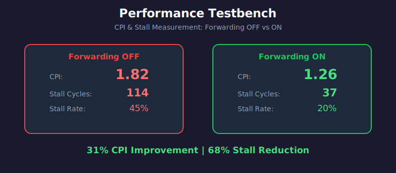

# Contribution 1: Performance Testbench

## Overview
A specialized testbench for measuring CPU performance metrics including CPI, IPC, and stall cycles.



## Files
- [`testbench_metrics.v`](../../testbench_metrics.v) - Basic metrics testbench
- [`testbench_metrics_enhanced.v`](../../testbench_metrics_enhanced.v) - Enhanced version with detailed analysis

## Key Features
- Cycle counting
- Dynamic instruction counting
- Stall cycle tracking (total, load-use, branch flush)
- CPI/IPC calculation
- Pipeline efficiency analysis

## How to Run (Vivado)

### Complete TCL Commands
```tcl
# Step 1: Close any existing simulation
close_sim -force

# Step 2: Set the testbench as top module
set_property top testbench_metrics_enhanced [get_filesets sim_1]

# Step 3: Launch simulation
launch_simulation

# Step 4: Run to completion
run -all
```

### Quick One-Liner
```tcl
close_sim -force; set_property top testbench_metrics_enhanced [get_filesets sim_1]; launch_simulation; run -all
```

## Results (Vivado 2025.2 Simulation)

| Configuration | Cycles | Instructions | Stalls | CPI |
|--------------|--------|--------------|--------|-----|
| **FWD=0** (No Forwarding) | 255 | 140 | 114 | **1.82** |
| **FWD=1** (With Forwarding) | 182 | 144 | 37 | **1.26** |

### Performance Improvements
- **CPI Improvement**: 1.82 → 1.26 = **31%**
- **Stall Reduction**: 114 → 37 = **68%**
- **Pipeline Efficiency**: 55% → 79%
- Forwarding almost eliminates Data Hazard delays!

## Demo Videos

### Without Forwarding (CPI = 1.82)


### With Forwarding (CPI = 1.26)


