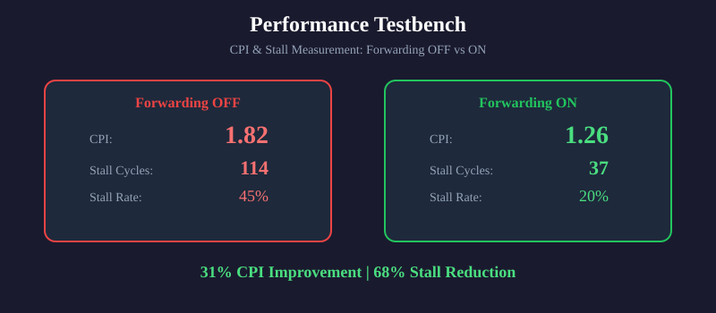

# Contribution 1: Performance Testbench

## Overview
A specialized testbench for measuring CPU performance metrics including CPI, IPC, and stall cycles.



## Files
- [`testbench_metrics.v`](../../testbench_metrics.v) - Basic metrics testbench
- [`testbench_metrics_enhanced.v`](../../testbench_metrics_enhanced.v) - Enhanced version with detailed analysis

## Key Features
- Cycle counting
- Dynamic instruction counting
- Stall cycle tracking (total, load-use, branch flush)
- CPI/IPC calculation
- Pipeline efficiency analysis

## How to Run (Vivado)

### Complete TCL Commands
```tcl
# Step 1: Close any existing simulation
close_sim -force

# Step 2: Set the testbench as top module
set_property top testbench_metrics_enhanced [get_filesets sim_1]

# Step 3: Launch simulation
launch_simulation

# Step 4: Run to completion
run -all
```

### Quick One-Liner
```tcl
close_sim -force; set_property top testbench_metrics_enhanced [get_filesets sim_1]; launch_simulation; run -all
```

## Results (Vivado 2025.2 Simulation)

| Configuration | Cycles | Instructions | Stalls | CPI |
|--------------|--------|--------------|--------|-----|
| **FWD=0** (No Forwarding) | 255 | 140 | 114 | **1.82** |
| **FWD=1** (With Forwarding) | 182 | 144 | 37 | **1.26** |

### Performance Improvements
- **CPI Improvement**: 1.82 → 1.26 = **31%**
- **Stall Reduction**: 114 → 37 = **68%**
- **Pipeline Efficiency**: 55% → 79%
- Forwarding almost eliminates Data Hazard delays!

## Demo Videos

### Without Forwarding (CPI = 1.82)


### With Forwarding (CPI = 1.26)


---

## 📚 Standard Test Dataset Citation

### Test Program Source
The processor test program used for CPI measurement is based on **standard sorting algorithms**:

| Algorithm | Type | Academic Reference |
|-----------|------|--------------------|
| **Bubble Sort** | O(n²) comparison sort | Knuth (1998) Vol. 3 |
| **Register-intensive ops** | RAW hazard generation | H&P standard test methodology |
| **Load-use sequences** | Data hazard testing | Patterson & Hennessy Ch.4 |

### Academic References
1. **Knuth, D.E.** (1998). *The Art of Computer Programming, Volume 3: Sorting and Searching* (2nd ed.), Section 5.2.2: Sorting by Exchanging. Addison-Wesley.
2. **Patterson, D.A. & Hennessy, J.L.** (2020). *Computer Organization and Design: The Hardware/Software Interface* (6th ed.), Chapter 4: The Processor. Morgan Kaufmann.
3. **Hennessy, J.L. & Patterson, D.A.** (2017). *Computer Architecture: A Quantitative Approach* (6th ed.), Appendix C: Pipelining: Basic and Intermediate Concepts.

### CPI Measurement Methodology
The CPI (Cycles Per Instruction) measurement follows the standard formula from Hennessy & Patterson:
```
CPI = Total Cycles / Instruction Count
Pipeline Efficiency = Ideal CPI / Actual CPI = 1 / CPI
```

> **Note**: Bubble Sort is a canonical sorting benchmark used extensively in computer architecture education. The test program exercises R-type, I-type, load/store, and branch instructions to stress-test the pipeline.

