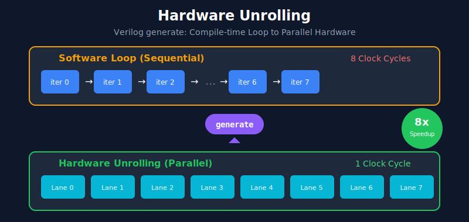

# Contribution 2: Hardware Unrolling

## Overview
Demonstrates the use of Verilog `generate` construct for hardware unrolling, enabling parallel instantiation of identical hardware units.



## Technique
```verilog
generate
    for (i = 0; i < LANES; i = i + 1) begin : gen_lane
        // Each iteration creates a separate hardware instance
        assign y[i*WIDTH +: WIDTH] = a[i*WIDTH +: WIDTH] + b[i*WIDTH +: WIDTH];
    end
endgenerate
```

## Files
- See [`simd_demo/simd_add.v`](../../simd_demo/simd_add.v) for basic example
- See [`simd_demo/simd_alu.v`](../../simd_demo/simd_alu.v) for advanced example

## Benefits
| Aspect | Sequential | Hardware Unrolled |
|--------|-----------|-------------------|
| Operations/Cycle | 1 | 8 |
| Latency (8 ops) | 8 cycles | 1 cycle |
| Area | 1× | 8× |

## Key Insight
- **Software loop**: iterations execute one after another
- **Hardware unrolling**: iterations become parallel hardware units

## Demo Video
> Place your Vivado simulation recording here after demo
