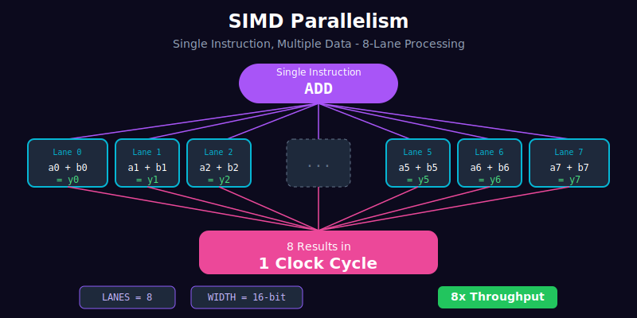

# Contribution 3: SIMD Parallelism

## Overview
Data-Level Parallelism (DLP) demonstration using 8-lane SIMD (Single Instruction, Multiple Data) architecture.



## Concept
```
SIMD = One instruction, multiple data elements processed in parallel

Traditional:     SIMD (8 lanes):
  a[0] + b[0]      a[0..7] + b[0..7]
  a[1] + b[1]         ↓
  a[2] + b[2]      y[0..7]
  ...              (all in 1 cycle!)
  a[7] + b[7]
  (8 cycles)       (1 cycle)
```

## Files
- [`simd_demo/simd_add.v`](../../simd_demo/simd_add.v) - 8-lane parallel adder
- [`simd_demo/tb_simd_add.v`](../../simd_demo/tb_simd_add.v) - Testbench

## Parameters
| Parameter | Value | Description |
|-----------|-------|-------------|
| LANES | 8 | Number of parallel lanes |
| WIDTH | 8 | Bits per data element |

## Performance
- **Throughput**: 8× improvement
- **Latency**: Same (1 cycle)

## Demo Video

### SIMD ALU Demo (40/40 Tests PASS)


**Demonstrates:**
- 8-lane parallel processing
- 5 operations (ADD, SUB, MUL, DIV, EXP)
- All 40 test cases PASS

