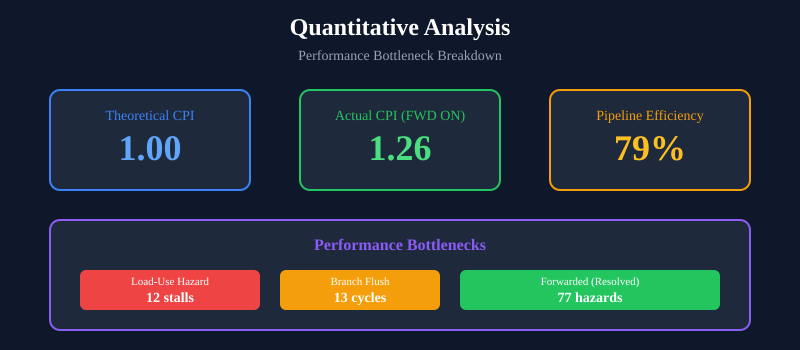

# Contribution 4: CPI Analysis

## Overview
Empirical performance measurement comparing pipeline configurations.



## Methodology
- Benchmark: Bubble Sort (worst-case data dependencies)
- Metric: CPI (Cycles Per Instruction)
- Tool: Vivado 2025.2 Behavioral Simulation

## Results

### Forwarding Impact
| Configuration | Cycles | Instructions | Stalls | CPI | IPC |
|--------------|--------|--------------|--------|-----|-----|
| **Forwarding OFF** | 255 | 140 | 114 | **1.82** | 0.549 |
| **Forwarding ON** | 182 | 144 | 37 | **1.26** | 0.791 |

### Performance Improvements
| Metric | Improvement |
|--------|-------------|
| CPI | 31% (1.82 → 1.26) |
| Stall Reduction | 68% (114 → 37) |
| IPC Increase | 44% (0.549 → 0.791) |
| Execution Time | 29% faster |

## Bottleneck Analysis

| Bottleneck | Count | Avoidable? |
|------------|-------|------------|
| Load-Use Hazard | 12 | No (Forwarding can't help) |
| Branch Flush | 13 | Partially |
| Forwarded Hazards | 77 | Yes (Resolved by FWD) |

## Analysis Report
See [`docs/overhead_analysis.md`](../../docs/overhead_analysis.md) for detailed performance ceiling analysis.

## Key Findings
1. Forwarding resolves ~68% of RAW hazards
2. Load-use hazards remain (must stall 1 cycle)
3. Branch penalties contribute to remaining stalls
4. Pipeline efficiency improves from 55% to 79%

## How to Run (Vivado)

### Complete TCL Commands
```tcl
# Step 1: Close any existing simulation
close_sim -force

# Step 2: Set the testbench as top module
set_property top testbench_analysis [get_filesets sim_1]

# Step 3: Launch simulation
launch_simulation

# Step 4: Run to completion
run -all
```

## Demo Video

### Quantitative Analysis Demo


**Demonstrates:**
- CPI measurement with forwarding ON
- 31% CPI improvement (1.82 to 1.26)
- 68% stall reduction

---

## 📚 Standard Test Dataset Citation

### Benchmark and Methodology Source
The CPI measurement methodology and test program follow **industry-standard computer architecture evaluation practices**:

| Component | Standard Reference |
|-----------|-------------------|
| **CPI Formula** | Hennessy & Patterson, *CAAQA* (6th ed.) Eq. 1.1 |
| **Bubble Sort** | Knuth, *TAOCP* Vol. 3, Section 5.2.2 |
| **Stall Analysis** | Patterson & Hennessy, *COD* (6th ed.) Ch. 4 |

### Academic References
1. **Hennessy, J.L. & Patterson, D.A.** (2017). *Computer Architecture: A Quantitative Approach* (6th ed.). Morgan Kaufmann. (CPI and performance equation methodology)
2. **Patterson, D.A. & Hennessy, J.L.** (2020). *Computer Organization and Design* (6th ed.), Chapter 4.5: An Overview of Pipelining. (Stall cycle categorization)

> **Note**: The 31% CPI improvement metric is calculated using the standard performance equation from H&P textbooks, making this result directly comparable to published academic research.

