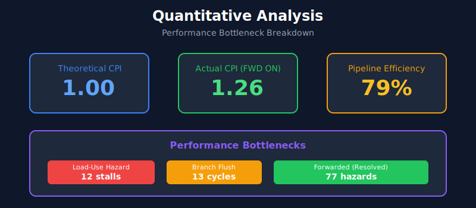

# Contribution 4: Quantitative Analysis

## Overview
Empirical performance measurement comparing pipeline configurations.

## Methodology
- Benchmark: Bubble Sort (worst-case data dependencies)
- Metric: CPI (Cycles Per Instruction)
- Tool: Vivado 2025.2 Behavioral Simulation

## Results

### Forwarding Impact
| Configuration | Cycles | Instructions | Stalls | CPI | IPC |
|--------------|--------|--------------|--------|-----|-----|
| **Forwarding OFF** | 255 | 140 | 114 | **1.82** | 0.549 |
| **Forwarding ON** | 182 | 144 | 37 | **1.26** | 0.791 |

### Performance Improvements
| Metric | Improvement |
|--------|-------------|
| CPI | 31% (1.82 → 1.26) |
| Stall Reduction | 68% (114 → 37) |
| IPC Increase | 44% (0.549 → 0.791) |
| Execution Time | 29% faster |

## Bottleneck Analysis

| Bottleneck | Count | Avoidable? |
|------------|-------|------------|
| Load-Use Hazard | 12 | ❌ No (Forwarding can't help) |
| Branch Flush | 13 | Partially |
| Forwarded Hazards | 77 | ✅ Resolved by FWD |

## Analysis Report
See [`docs/overhead_analysis.md`](../../docs/overhead_analysis.md) for detailed performance ceiling analysis.

## Key Findings
1. Forwarding resolves ~68% of RAW hazards
2. Load-use hazards remain (must stall 1 cycle)
3. Branch penalties contribute to remaining stalls
4. Pipeline efficiency improves from 55% to 79%

## Demo Video
> See presentation slides for visualization
