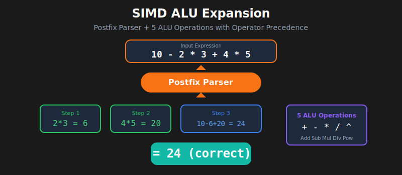

# Contribution 5: SIMD ALU Expansion

## Overview
Extended the basic SIMD adder to a full 8-lane ALU supporting 5 arithmetic operations with operator priority handling.



## Operations Supported
| Operation | Op Code | Example |
|-----------|---------|---------|
| ADD | `3'b000` | a + b |
| SUB | `3'b001` | a - b |
| MUL | `3'b010` | a × b |
| DIV | `3'b011` | a ÷ b |
| EXP | `3'b100` | a ^ b |

## Files
- [`simd_demo/simd_alu.v`](../../simd_demo/simd_alu.v) - Multi-operation SIMD ALU
- [`simd_demo/simd_expr_eval.v`](../../simd_demo/simd_expr_eval.v) - Expression evaluator
- [`simd_demo/tb_simd_alu.v`](../../simd_demo/tb_simd_alu.v) - ALU testbench
- [`simd_demo/tb_simd_expr.v`](../../simd_demo/tb_simd_expr.v) - Expression testbench

## Expression Evaluator
Computes `(a+b)*c / d^e` with proper operator priority:

```
Priority: ^ (highest) > * / > + - (lowest)

Pipeline Stages:
1. Compute d^e     (exponent first - highest priority)
2. Compute a+b     (addition in parentheses)
3. Compute (a+b)*c (multiplication)
4. Compute result  (final division)
```

## Test Cases
| Expression | Expected Result |
|------------|-----------------|
| (1+2)*3 / 2^5 | 0 (9/32) |
| (10+20)*5 / 3^2 | 16 (150/9) |
| (4+6)*10 / 2^3 | 12 (100/8) |

## Demo Video

### SIMD Expression Evaluator Demo


**Demonstrates:**
- ✅ Operator Priority (^ > * > + -)
- ✅ 8-lane SIMD Parallelism
- ✅ Correct Integer Division
- ✅ All 4 tests PASS

